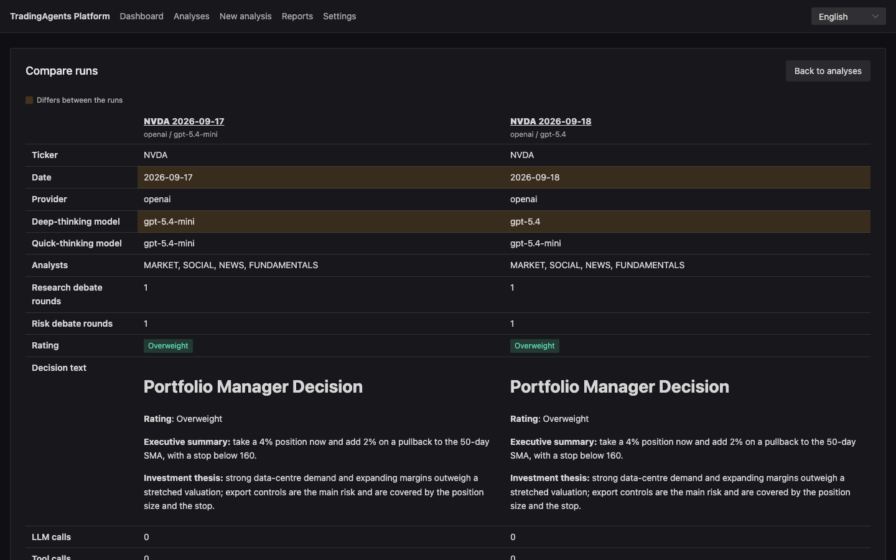

# TradingAgents Platform

[](https://github.com/ramazangirgin/trading-analysis-platform/actions/workflows/ci.yml)

A web platform for running and managing [TradingAgents](https://github.com/TauricResearch/TradingAgents)
analyses without modifying its code: start an analysis from the browser, watch the agents work live,
then read the decision, the reports and the debates, and export them. The roadmap is the
[GitHub issues](https://github.com/ramazangirgin/trading-analysis-platform/issues);
[docs/event-protocol.md](docs/event-protocol.md) describes the runner contract.


| Artifact | Path | Stack |
|---|---|---|
| Platform (backend + UI, one jar) | `artifact/backend`, `artifact/frontend` | Java 25, Spring Boot 4.1 · Vue 3.5, Vite, Naive UI |
| Runner (installed into the TradingAgents runtime) | `artifact/ta-runner` | Python 3.12, uv, TradingAgents `v0.5.1` |
| Docker images and Compose setup | `deploy/`, `artifact/ta-runner/Dockerfile` | Temurin 25 JRE · PostgreSQL 18 · docker-socket-proxy |
| End-to-end tests (not shipped) | `e2e/` | Playwright, against the built jar |

Two ways to run it: on your machine with `mise run run` ([Quick start](#quick-start)), or with
Docker Compose, where each analysis runs in its own container and the data is kept in PostgreSQL
([Run with Docker Compose](#run-with-docker-compose)).

## Quick start

### 1. Prerequisites

- [mise](https://mise.jdx.dev/) — it installs the rest: Java 25 (Temurin) and
  [uv](https://docs.astral.sh/uv/), pinned in [`mise.toml`](mise.toml), into its own directory.
  Install it with `curl https://mise.run | sh` (or `brew install mise`).
- An API key for at least one LLM provider (OpenAI, Anthropic, Google, DeepSeek, xAI, Mistral,
  Groq, …), or a local [Ollama](https://ollama.com/), which needs no key.
- Docker or Podman. `mise run run` and `mise run dev` start a local PostgreSQL 18 container
  (`mise run db`; its data is in the volume `trading-analysis-platform-db`; `mise run db:stop` stops
  it, `mise run db:reset` deletes its data). To use your own PostgreSQL 18 server instead, set
  `PLATFORM_DB_HOST`, `PLATFORM_DB_PORT`, `PLATFORM_DB_NAME`, `PLATFORM_DB_USER` and
  `PLATFORM_DB_PASSWORD`; then no container is started if `PLATFORM_DB_HOST` is another host. For a
  server on `localhost` also set `PLATFORM_DB_CONTAINER=false`, else the container is started and
  needs the port free (Docker is still needed for the backend tests).
- Nothing else: Node.js and pnpm are downloaded by the build, Python 3.12 by uv.

### 2. Start the platform

```sh
git clone https://github.com/ramazangirgin/trading-analysis-platform.git
cd trading-analysis-platform
mise trust && mise install   # once: Java 25 and uv for this repository
mise run setup               # once: ta-runner (downloads TradingAgents) and the UI packages
mise run run                 # builds the app if needed and serves it on :8080
```

Open **http://127.0.0.1:8080**. One process serves both the UI and the API; keep the terminal open
while you use it, and stop it with Ctrl+C. The first start takes a few minutes (Gradle's
dependencies, Node, building the UI and the backend); after that it starts in seconds, and after a
`git pull` it rebuilds only what changed. Analyses, presets and keys live on disk
([Where things live](#where-things-live)), so they survive restarts.

If the platform stops while an analysis runs (a crash, a `kill`), the analysis keeps going; the
restarted platform follows it again, or records its result if it finished meanwhile, and starts
queued analyses again. Ctrl+C in the terminal stops the running analyses too.

Changing the code instead? See [Development](#development) — it runs the UI with hot reload.

### 3. Add an API key

Open **Settings**, paste the key next to its provider and press **Save**. Keys are stored in
`~/.tradingagents-platform/secrets.env` (owner-only) and are never shown back. A key already in
`artifact/ta-runner/.env` is picked up too (read-only).


### 4. Start an analysis

Open **New analysis** and fill in:

| Field | What to enter |
|---|---|
| Ticker | Any Yahoo Finance symbol: `NVDA`, `THYAO.IS`, `BTC-USD` (crypto pairs switch the asset type automatically) |
| Analysis date | Defaults to the last weekday; future dates are rejected |
| Analysts | Market, Sentiment, News, Fundamentals — fewer analysts means a faster, cheaper run |
| Provider, models | A deep-thinking model (research/portfolio managers) and a quick-thinking one (everyone else); you can type a model id that is not listed |
| Debate rounds | 1 is enough to start; every extra round adds LLM calls |
| Report language | The language of the reports and the decision; follows the UI language by default |

Press **Start analysis**. **Save as preset** keeps the provider, model and analyst choices for next
time; **Settings** lists the presets with what each holds, and renames or deletes them.


### 5. Watch it and read the results

The analysis page updates live: the agent pipeline (analysts → research debate → trader → risk
debate → portfolio manager), a feed of agent messages and tool calls, the runner log, and token
counts. A full run with all four analysts can take 20 minutes or more, depending on the model and
the debate rounds (the example above: 41 LLM calls, ~1.1M input tokens, 18 minutes). **Stop** ends it; **Run again**
repeats it with the same settings.


When it finishes, the decision card shows the portfolio manager's rating (Buy / Overweight / Hold /
Underweight / Sell) with its reasoning, and the tabs hold everything behind it:

| Reports — one per analyst and manager | Debates — bull vs. bear, then the risk debate |
|---|---|
|  |  |


The cost is worked out per LLM call from the provider's published prices
([LLM prices](#llm-prices)); a model without a known price shows no cost.

The market report opens with a price chart — close, 10 EMA, 50 SMA and 200 SMA with volume, over
3 months to a year up to the analysis date, from the price data TradingAgents itself downloaded —
and report tables that are series over periods (quarterly or yearly figures) get a chart beside them:


### 6. Past analyses

**Analyses** lists every run with its analysis date and start time, decision, model and duration,
filterable by ticker and status.
Runs made outside the platform are imported (read-only) and show up by themselves within about
10 seconds, as the data dir is watched; **Scan data dir** forces a rescan:

- reports the TradingAgents CLI (or another UI) left in `~/.tradingagents/logs`;
- a third-party UI's run history, `~/.tradingagents/runs.json`: its failed runs with their errors,
  and the models, token counts, cost and timing of the finished ones;
- deep-analysis write-ups, `~/.tradingagents/reports/<TICKER>_deep_<DATE>.md`, as a
  *Deep analysis* section of that ticker and date's report.

A run whose report files are still being written is not shown as failed; it appears once it
finishes.


To compare runs, tick two to four of them and press **Compare**: the compare view shows them side
by side, one column per run, with the settings (ticker, date, provider and models, analysts,
debate rounds), the decision, the stats and the report sections. Rows whose values differ between
the runs are highlighted, so the same ticker run with another model or date can be compared at a
glance. The run ids are in the page's URL, so a comparison can be bookmarked or shared.



The **Dashboard** shows the running analyses and the latest decisions at a glance.


### 7. Reports and export

**Reports** gathers every finished report in one place: the list of tickers and dates on the left,
the report's contents in the middle (each section with its headings, then the debates), and the
report itself with its charts on the right. The data dir keeps one report per ticker and date, so
when a ticker and date ran several times, this is the newest run's report.

**Markdown**, **HTML** and **PDF** export the open report: the HTML file is a single page that
opens anywhere, and PDF goes through the browser's print dialog (*Save as PDF*). On a phone the page
folds into one column, with the list as a picker and the contents folded above the report.


### Language

The UI is in English. Reports are written in the language chosen in the New Analysis form's
"Report language" field; the analysis page shows it as a tag.

## Run with Docker Compose

For a server (or any machine with Docker or Podman): the platform, PostgreSQL and a socket proxy
run as containers, and every analysis runs in a container of its own that is removed afterwards.

```
browser ──▶ 127.0.0.1:8080 ──▶ platform ──▶ postgres
                                  │
                                  └──▶ docker-socket-proxy ──▶ Docker / Podman engine
                                                                  │  one per analysis
                                                                  ▼
                                                          ta-runner container
```

**Needs:** Docker with Compose v2, or Podman with `docker compose` pointed at its socket; and
[mise](https://mise.jdx.dev/) to build the images.

```sh
cp deploy/.env.example deploy/.env      # set PLATFORM_DATA and POSTGRES_PASSWORD
mise run docker-build                   # builds trading-analysis-platform and ta-runner, tagged latest and with the version
docker compose -f deploy/docker-compose.yml up -d
```

Open **http://127.0.0.1:8080** (or the `PLATFORM_PORT` you set) and add an API key under
**Settings**, as in the [Quick start](#3-add-an-api-key). `docker compose -f deploy/docker-compose.yml
down` stops everything; `up -d` brings it back with all data.

**Data** stays on the machine, in the folder named by `PLATFORM_DATA` (an absolute path):

| Folder | What |
|---|---|
| `postgres/` | The database: analyses, presets and users. Survives restarts, `down` and image updates. |
| `platform/` | `secrets.env` (API keys, owner-only), `runs/<id>/` (events and runner logs), optional `prices.json` |
| `tradingagents/` | TradingAgents' reports, price cache and memory log, written by the analysis containers |

Back up the whole folder; for the database alone, `docker compose -f deploy/docker-compose.yml exec
postgres pg_dump -U platform platform > platform.sql`. Table and column names are uppercase and
stored quoted, so a hand query quotes them too: `SELECT * FROM "ANALYSES";`.

**How analyses run:** the platform asks the engine, through docker-socket-proxy, for one
`ta-runner` container per analysis: read-only root filesystem, no Linux capabilities, a non-root
user, 2 GB of memory and 2 CPUs, and only the `tradingagents/` folder mounted. The proxy lets the
platform create, start, stop and remove containers and nothing else (no `exec`, images, volumes or
networks). If the platform restarts during an analysis, the container keeps running and the
platform picks it up again.

**Notes**

- **SELinux** (Fedora, RHEL, Podman machines): the Compose file labels its folders with `:z`, and
  the proxy runs without SELinux labelling so it can reach the socket.
- **Podman on macOS:** `PLATFORM_DATA` must be a folder the Podman machine can see. A machine
  created without `--volume` shares no macOS folders; use a path inside the machine (e.g.
  `/var/home/core/trading-analysis-platform`) or recreate it with `podman machine init --volume
  $HOME:$HOME`. `DOCKER_SOCKET` is the socket path inside the machine (`/var/run/docker.sock` on a
  rootful one).
- **Exposing it beyond localhost** needs authentication and HTTPS first (not built yet; see the
  [GitHub issues](https://github.com/ramazangirgin/trading-analysis-platform/issues)); the port is published on 127.0.0.1 only.
- The first start takes about a minute (longer under Podman's VM on macOS).

### Upgrading to 2.0.0

The database is migrated in place on the first start: enum columns become PostgreSQL enum types, an
analysis's analysts an array, and a role's permissions an array on the role (the `ROLE_PERMISSIONS`
table goes away). No data is lost, and nothing needs to be done. An older release cannot run on the
migrated database, so take a copy first if you may want to go back (the `pg_dump` above, with the
platform stopped).

### Upgrading to 1.0.0

PostgreSQL is now the platform's only database, and its schema was recreated, so **an existing
database is reset, not migrated**: the platform does not start on the old one (Flyway rejects its
history). Analyses that TradingAgents' CLI left in the data folder are imported again on startup;
runs the platform started, presets and users are lost. To reset:

```sh
docker compose -f deploy/docker-compose.yml down
# optional, to keep a copy: start only postgres, run the pg_dump above, then down again
rm -rf "$PLATFORM_DATA/postgres"        # the folder PLATFORM_DATA names in deploy/.env
docker compose -f deploy/docker-compose.yml up -d
```

For runs on your machine (`mise run run`) nothing is needed on a first start; a
`~/.tradingagents-platform/platform.db` file from an earlier version is no longer used and can be
deleted. `mise run db:reset` empties the local database later, whenever you want a fresh one.

## Where things live


| Path | What |
|---|---|
| PostgreSQL | Analyses, presets and users: in the local container's volume `trading-analysis-platform-db`, or on your own server ([Prerequisites](#1-prerequisites)) |
| `~/.tradingagents-platform/runs/<id>/` | `spec.json`, `events.jsonl` (replayed to the UI), `run.log` (runner stderr) |
| `~/.tradingagents-platform/prices.json` | Optional: your own LLM prices, over the ones ta-runner ships (see below) |
| `~/.tradingagents/logs/` | TradingAgents' own reports, shared with its CLI; runs found here are imported (read-only) |

Override with `PLATFORM_HOME`, `TRADINGAGENTS_HOME` or `TRADINGAGENTS_RESULTS_DIR`. With Docker
Compose everything is under `PLATFORM_DATA` instead ([Run with Docker Compose](#run-with-docker-compose)).

### LLM prices

A run's cost is worked out per LLM call from
[`artifact/ta-runner/ta_runner/pricing/prices.json`](artifact/ta-runner/ta_runner/pricing/prices.json): DeepSeek,
OpenAI, Anthropic and Google, read from their official pricing pages on 2026-09-30 (peak hours,
long-context tiers and cached input included). A model without a price shows no cost rather than
a guess. To add or correct prices, create `~/.tradingagents-platform/prices.json` in the same shape;
its models replace the shipped ones one by one:

```json
{"providers": {"ollama": {"models": {"qwen3:latest": [{"input": 0, "output": 0}]}},
               "openai": {"models": {"gpt-5.6": [{"input": 2.0, "cached_input": 0.2, "output": 12.0}]}}}}
```

Prices are USD per 1M tokens. New runs pick the file up; finished runs keep their cost.

## Development

### Dev servers

```sh
mise run dev
```

This starts two processes, and keeps them running until Ctrl+C:

| Process | Port | What it does |
|---|---|---|
| Spring Boot backend | 8080 | The API (`/api/...`), the database, starting and stopping analyses (it launches ta-runner) |
| Vite dev server | 5173 | Serves the Vue UI straight from `artifact/frontend/src`, reloads the browser on every change, and forwards `/api/...` to the backend |

Open **http://localhost:5173** (not :8080) while developing. UI changes show up immediately; backend
changes need a restart of `mise run dev`. Nothing listens on 5173 unless `mise run dev` is running —
to just use the app, `mise run run` is enough.

### Tasks

```sh
mise run setup         # uv sync for ta-runner (downloads TradingAgents), frontend packages, Git hooks
mise run dev           # backend on :8080 + Vite with hot reload on http://localhost:5173 (starts the local PostgreSQL)
mise run build         # all tests (ArchUnit included), lint (Checkstyle included), and the single jar
mise run run           # the single jar on http://127.0.0.1:8080, rebuilt when something changed (starts the local PostgreSQL)
mise run db            # start the local PostgreSQL container (run and dev do it for you)
mise run db:stop       # stop it; the data stays in the volume
mise run db:reset      # remove the container and its volume: the next start is an empty database
mise run test          # backend + frontend + ta-runner tests
mise run runner-test   # ta-runner lint, import contracts and tests only
mise run e2e           # end-to-end tests: the jar on a throwaway PostgreSQL container, in Google Chrome, ta-runner replaying a recording
mise run screenshots   # retake the README's screenshots (e2e/screenshots/*.shot.ts), the same way
mise run check         # quick check before pushing: package structure, lint, formatting, type-check (no tests)
mise run format        # format every Java (Spotless), frontend and e2e (Prettier) file
mise run format-check  # check the formatting of every Java, frontend and e2e file, as CI does
mise run hooks         # install the Git hooks (lefthook.yml)
mise run api-types     # refresh the frontend's API types from the running backend
mise run docker-build  # the platform and ta-runner Docker images
mise run version       # the platform version
mise run version:bump minor   # raise it (major, minor or patch) in every file; see Versioning and releases
```

`run`, `dev`, `build`, `test`, `e2e` and `screenshots` need Docker or Podman (a PostgreSQL container;
the backend tests start theirs through Testcontainers; on a Podman machine the build points
Testcontainers' cleanup container at the machine's own socket, so no local setting is needed). `mise tasks` lists them. Tasks run with the pinned Java on `PATH` and `JAVA_HOME` set, so nothing
needs overriding; with [mise activated](https://mise.jdx.dev/getting-started.html#activate-mise) in
your shell, plain `./gradlew` and `uv` in this directory use the same versions.

### Continuous integration

[`.github/workflows/ci.yml`](.github/workflows/ci.yml) runs on every push to any branch (main
included), on every pull request, and on demand (*Run workflow* on the Actions tab):

| Job | What |
|---|---|
| Backend and frontend | `mise run format-check`: formatting of every Java and frontend file; then `mise run build`: Spotless, Checkstyle, every Gradle test (ArchUnit, the Docker runner against the runner's own Docker, every repository and Spring Boot test against PostgreSQL in a container (Testcontainers), the custom Checkstyle checks with their 100% coverage gate and the project rules' fixtures), frontend lint and tests, the jar |
| ta-runner | `mise run runner-test`: ruff, import-linter (package structure) and pytest, upstream contract tests included |
| Version | The version is the same in every file; in a pull request into `main`, it is also higher than `main`'s and than the latest release tag, and not yet tagged (Renovate's update pull requests are exempt from the bump) |
| End-to-end tests | The build job's jar, on a throwaway PostgreSQL container, in Google Chrome ([`e2e/`](e2e/), Playwright): new analysis, live run page and decision; reports and Markdown export; comparing two runs; settings (keys masked, presets). `ta-runner` replays a recording (`TA_RUNNER_REPLAY`, [`artifact/ta-runner/tests/fixtures/replay-run`](artifact/ta-runner/tests/fixtures/replay-run)) instead of calling an LLM. Traces are uploaded when a test fails |
| Docker images and Compose smoke test | Both images (GitHub's build cache), the runner image under the platform's lockdown flags, then [`deploy/smoke-test.sh`](deploy/smoke-test.sh): the Compose stack comes up, an analysis runs in its own container, and the data survives a database restart and `down`/`up` |

A last job, **CI passed**, succeeds only if all of them did. New jobs go into its `needs` list, so
the rules on `main` never have to change. Those rules (the repository ruleset "main"):

- Changes reach `main` only through pull requests; no direct or force pushes, and `main` cannot be
  deleted.
- A pull request merges once **CI passed** is green, its branch is up to date with `main`, and a
  code owner has approved it ([`.github/CODEOWNERS`](.github/CODEOWNERS): the admins).
- Admins can merge their own pull requests without an approval, and can merge one whose checks
  failed (GitHub's "bypass" option on the pull request). Nothing merges on its own: auto-merge is off.

Tools come from `mise.toml`, as locally. A newer push to the same branch cancels the run in progress
(not on main). The smoke test also runs locally: `deploy/smoke-test.sh /absolute/path/for/data` after
`mise run docker-build`.

#### Dependency updates

The hosted [Renovate](https://docs.renovatebot.com/) app ([`.github/renovate.json5`](.github/renovate.json5))
keeps every pinned dependency current: the Gradle version catalog and wrapper, the pnpm packages of
`artifact/frontend/` and `e2e/`, Node.js and pnpm of the build, ta-runner's uv dependencies, the
TradingAgents release, `mise.toml`'s tools, the Dockerfiles, the Compose file and the workflows'
actions. On Monday mornings (Europe/Berlin) it opens **one pull request with every update**, majors
included ("Update all dependencies", branch `renovate/all`), plus one for lock file maintenance. It
only takes releases at least **14 days old**; younger ones wait as "pending" on the dashboard. Java
stays on 25, Python on 3.12, Node.js on LTS majors, and PostgreSQL gets no major updates. Renovate's
dependency dashboard issue lists everything it tracks. Nothing merges automatically: the update pull
request runs the full CI and is merged by an admin like any other. Update pull requests skip the
version bump and ship with the next release (see below).

The schedule also holds for a manual run: to get the update pull request before Monday, tick
"Create all awaiting schedule PRs at once" on the dashboard issue (that starts a run). The *Renovate
run* workflow ([`renovate-run.yml`](.github/workflows/renovate-run.yml)), from the Actions tab or
`gh workflow run renovate-run.yml`, ticks the dashboard's "run again" checkbox: a run without the
schedule, for example to rebase the pull request after `main` moved.

When the update includes TradingAgents, CI fails until you finish it on the pull request's branch:
run `uv lock` in `artifact/ta-runner/` and commit `uv.lock`, and adapt `ta_runner/engine/compat.py`
and the contract tests to the new release.

The Claude Code skill `renovate-update`
([`.claude/skills/renovate-update/SKILL.md`](.claude/skills/renovate-update/SKILL.md)) does all of
this from your machine: `/renovate-update` ticks every mature update on the dashboard (never the
pending ones) and requests a run, waits for the pull requests and their CI, and fixes a red CI on the
update branch: it adapts the code to the new release and moves the tools around it along. When that
is not possible yet, it shows you why and asks whether to hold the dependency back (an
`allowedVersions` rule) and open a follow-up issue, which the rule links. It stops at a green pull
request and merges only when you say so. `/renovate-update <pr>` fixes one open update pull request.

### Versioning and releases

The whole repository has one [Semantic Versioning](https://semver.org/) version, `MAJOR.MINOR.PATCH`:
the backend, the frontend and ta-runner always report the same one. It is set in
[`gradle.properties`](gradle.properties); `artifact/frontend/package.json` and
`artifact/ta-runner/ta_runner/__init__.py` carry copies, which `mise run version:bump` keeps in step
and CI checks. The running app shows it at the bottom of every page and at `/actuator/info`; the
images carry it as a tag and as the `org.opencontainers.image.version` label.

Every pull request into `main` raises the version in its own diff, or the **Version** job fails:

```sh
mise run version:bump minor   # a new feature or any other change
mise run version:bump major   # a breaking change: the REST API, the database without a migration,
                              # configuration, the ta-runner contract or the CLI
mise run version:bump patch   # hotfixes only
```

Renovate's dependency update pull requests are the one exception: they skip the bump (the hosted
app cannot run the script) and ship with the next pull request that raises the version.

Every version raised on `main` is a release. After **CI passed** on `main`,
[`.github/workflows/release.yml`](.github/workflows/release.yml) tags the commit `vX.Y.Z` and
publishes a [GitHub Release](https://github.com/ramazangirgin/trading-analysis-platform/releases)
with notes generated from the merged pull requests and the jar with its SHA-256 checksum. Tags are
created by that workflow only, never by hand. Two pull requests that raise to the same version cannot
both merge: the second one must be updated with `main` and bumped again. The rules and why:
[versioning and releases](docs/coding-convention/repository-versioning-and-releases.md).

### Agentic development

An issue can be taken to a reviewed pull request by agents, with you deciding at two points:
approving the plan and merging the pull request. Everything runs on your machine with Claude Code
and your own Claude Code login: Sonnet as the developer agent, Opus as the review agent. Agents
never merge.

A sample flow, for issue #32 (compare runs):

```text
# 1. Plan it: in Claude Code, in this repository
/plan-from-issue 32
#    Claude reads the issue and the docs of every part it touches, writes .plans/32-compare-runs.md,
#    and, once you agree, pushes it alone on branch plan/32-compare-runs and links it on #32.
```

```sh
# 2. Review the plan on plan/32-compare-runs; edit, commit and push there until it is right.

# 3. Let the agents implement it and take it to a pull request ready for review
mise run agent:run plan/32-compare-runs
#    developer agent: implements with tests, mise run check, version bump, opens a draft PR
#    after CI passed: review agent comments R1-1, R1-2, ... (CRITICAL / MAJOR / MINOR)
#    developer agent: one "Address R1-n: ..." commit or a reasoned reply per finding; CI again
#    a second review → fix round, then a final comment and the PR is marked ready for review

# 4. Review the PR (start with the final comment: open and declined findings), then
git fetch origin && git switch plan/32-compare-runs && git rebase origin/main   # if main moved
git push --force-with-lease                                                        # CI again
gh pr merge <pr> --rebase --delete-branch
#    CI on main releases vX.Y.Z; "Closes #32" closes the issue.
```

To go through the same flow one step at a time from Claude Code, approving each step before it
runs (plan, plan branch, implementation, every CI fix, review and fix round, finalising, updating
with `main`, merging), use the `develop-issue` skill instead: `/develop-issue 32` or
`/develop-issue <issue link>`. It continues where the issue stands when started again.

Each step, what to check at each decision, how to stop, continue or redo a run, and the settings:
[docs/agentic-development.md](docs/agentic-development.md).

### Coding conventions

Where each kind of class, component or module belongs, and what may import what, is written down in
[docs/coding-convention/](docs/coding-convention/README.md) and checked by the build (ArchUnit,
ESLint, import-linter) and by CI. The backend's Java code is also checked by Checkstyle
([rules and suppressions](docs/coding-convention/backend-java-checkstyle.md)) and formatted with
Spotless and Palantir Java Format ([formatting](docs/coding-convention/backend-java-formatting.md));
the frontend is formatted with Prettier. Git hooks run the static checks on staged files before a
commit; the backend's formatting check (changed files only), Checkstyle and ArchUnit rules run in
that hook too when Java files are staged, and CI checks the formatting of every file.
`mise run check` runs every structure check, lint, formatting check and the type-check by hand;
`mise run format` fixes the formatting.

### Before pushing

- `mise run test` must pass.
- After changing the REST API: with `mise run dev` running (restarted after the change), run
  `mise run api-types`. It saves the backend's OpenAPI spec as `artifact/frontend/openapi.json` and
  regenerates `artifact/frontend/src/shared/api/schema.d.ts`; commit both.

### ta-runner

```sh
cd artifact/ta-runner
uv sync
uv run pytest                       # unit, SIGTERM and upstream contract tests (no LLM calls)
uv run python -m ta_runner version

# Real analysis: needs the provider key in the environment (e.g. OPENAI_API_KEY).
# Edit example-spec.json (ticker, date, provider, models) first.
uv run python -m ta_runner run --spec example-spec.json --out /tmp/ta-run
```

Events stream to stdout as JSONL and are copied to `<out>/events.jsonl`; reports land under
`~/.tradingagents/logs/<TICKER>/<DATE>/reports/` (override with `TRADINGAGENTS_RESULTS_DIR`).

`TA_RUNNER_RECORD=<dir>` also records a run; `TA_RUNNER_REPLAY=<dir>` plays a recording back
through the same code path without calling an LLM (`TA_RUNNER_REPLAY_SPEED` speeds it up). The
end-to-end tests replay [`tests/fixtures/replay-run`](artifact/ta-runner/tests/fixtures/replay-run).

In a container the spec comes from an environment variable instead of a file:

```sh
docker run --rm -e TA_RUNNER_SPEC="$(cat example-spec.json)" -e OPENAI_API_KEY \
  ta-runner:latest run --spec-env TA_RUNNER_SPEC --out /tmp/run
```

### Testing the Docker runner

`DockerRunnerAdapterTest` and `DockerEngineInfoAdapterTest` run against a real engine at
`DOCKER_HOST` (Docker, or Podman's socket) and are skipped when there is none; the latter also
needs the `ta-runner:latest` image. To run the platform on your machine with the Docker runner
instead of the local venv: `PLATFORM_RUNNER=docker mise run run` (with a `tradingagents-data`
volume, or `TA_RUNNER_DATA_MOUNT` set to a folder the engine can mount).

## License

Licensed under the [Apache License 2.0](LICENSE). Copyright 2026 Ramazan Girgin.

[TradingAgents](https://github.com/TauricResearch/TradingAgents), which `ta-runner` installs, is
also Apache-2.0-licensed and remains under its authors' copyright.
