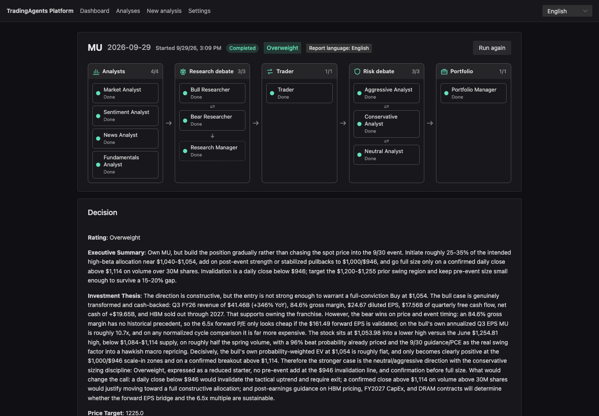
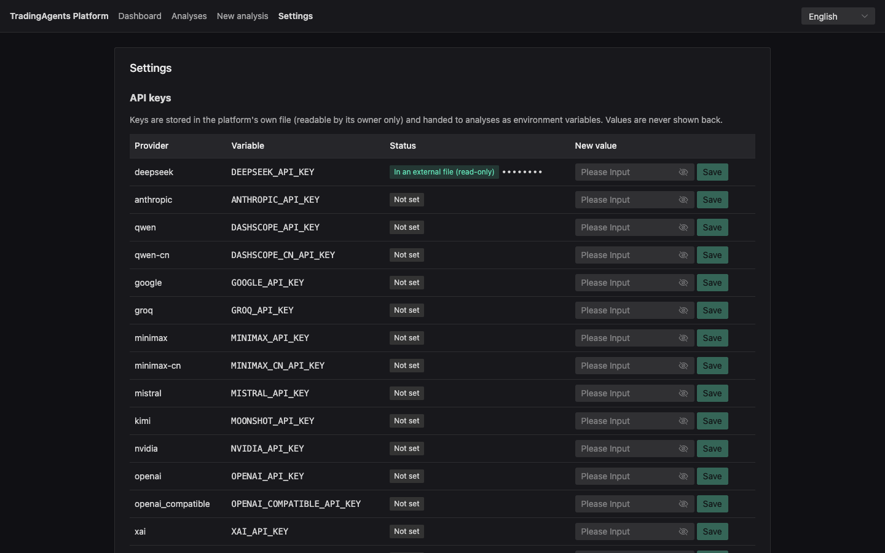
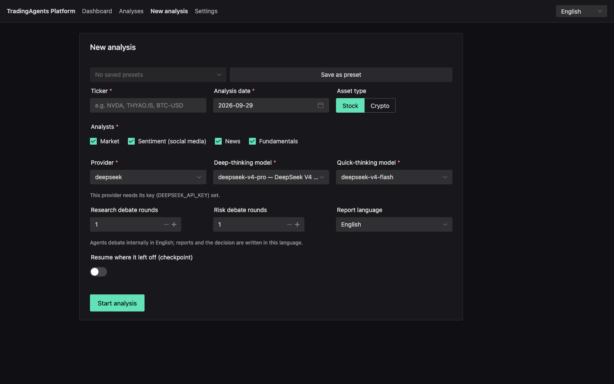
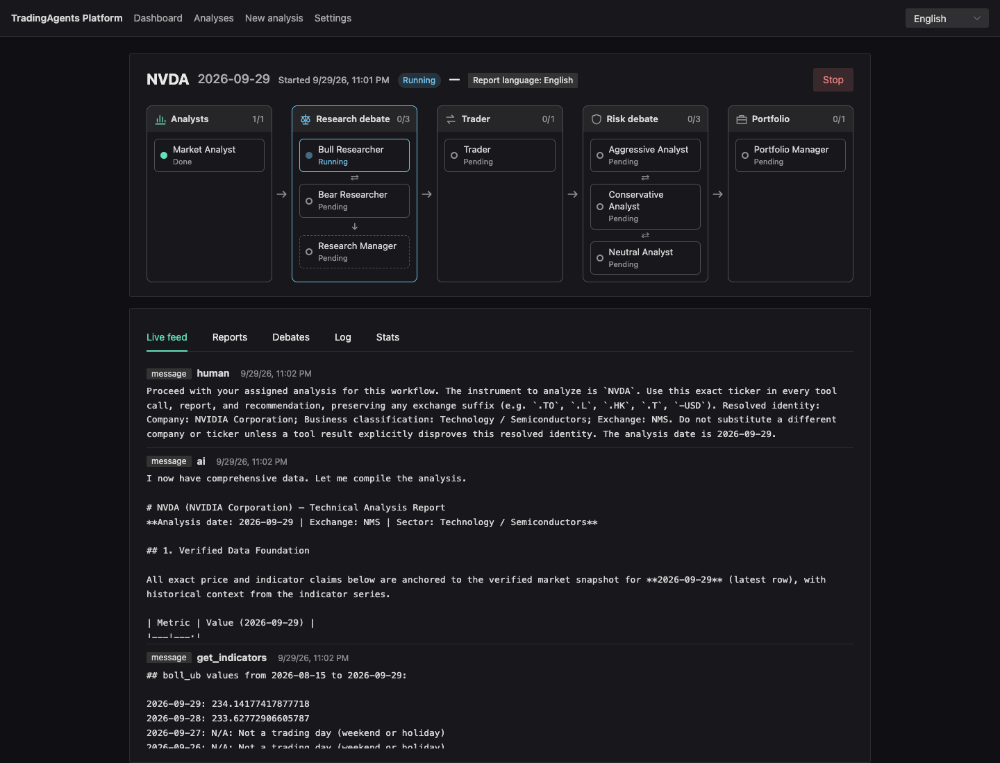
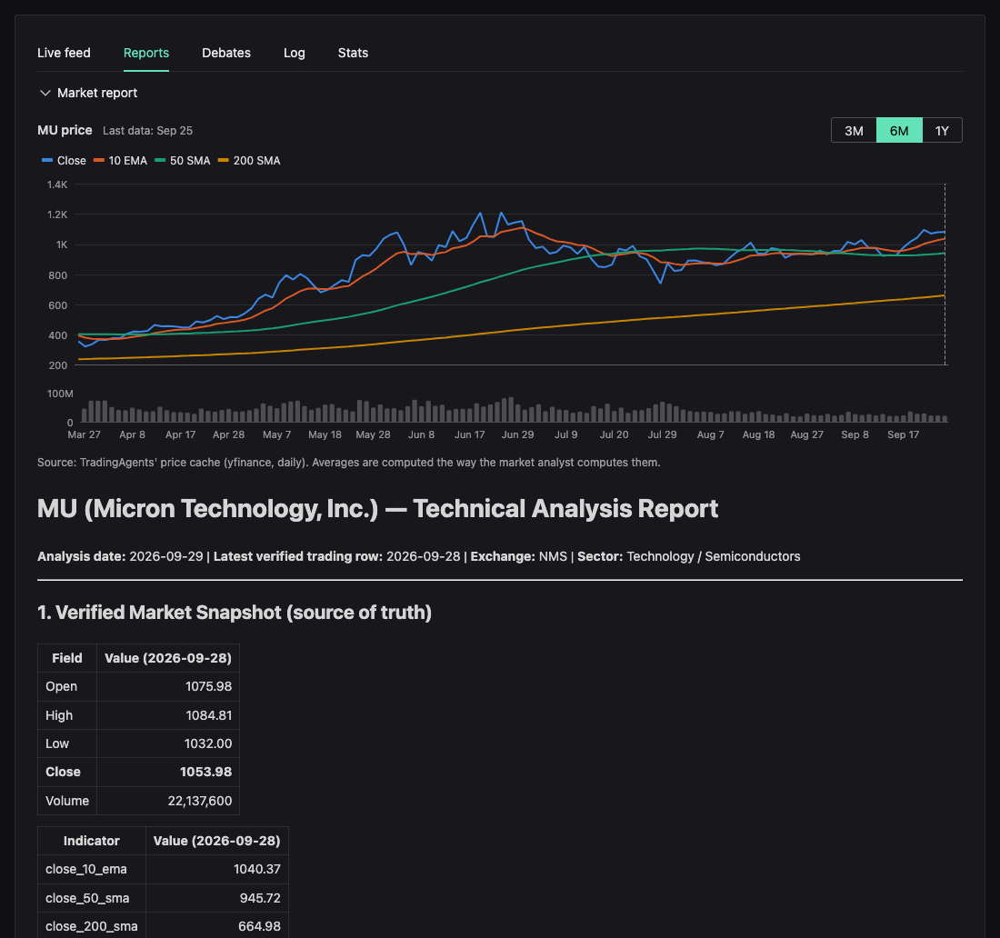
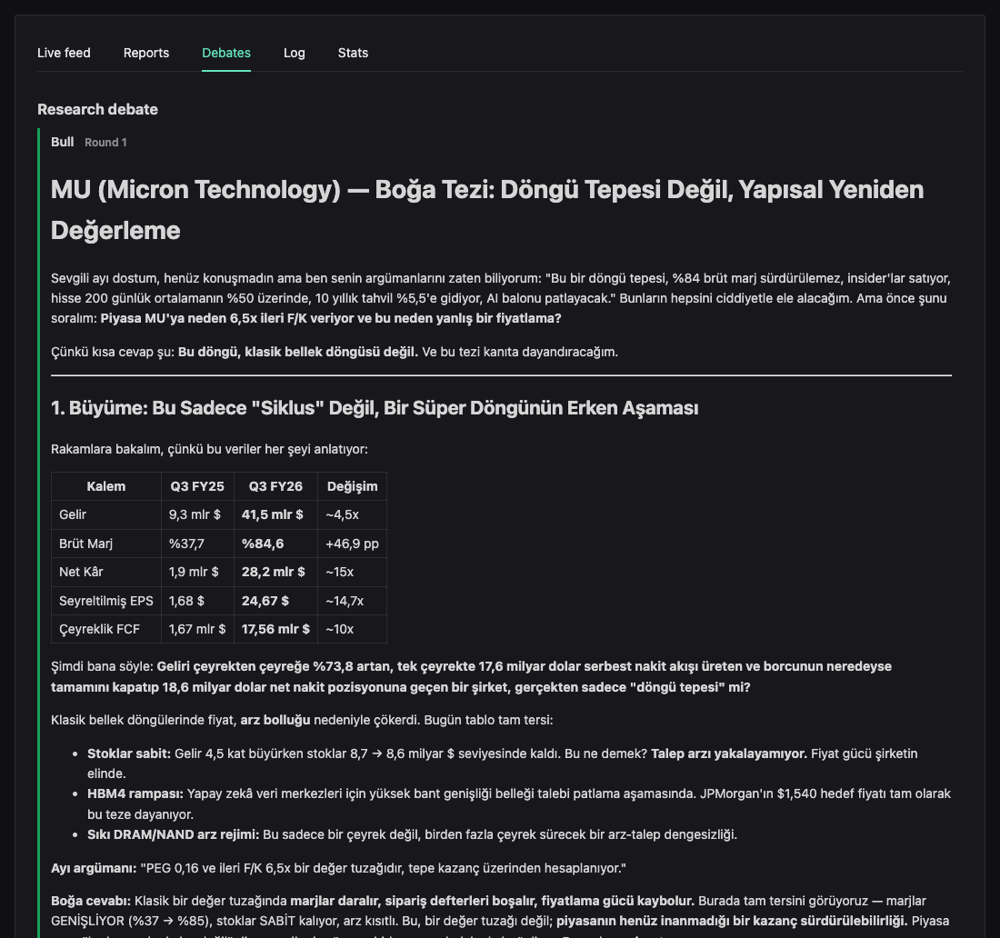
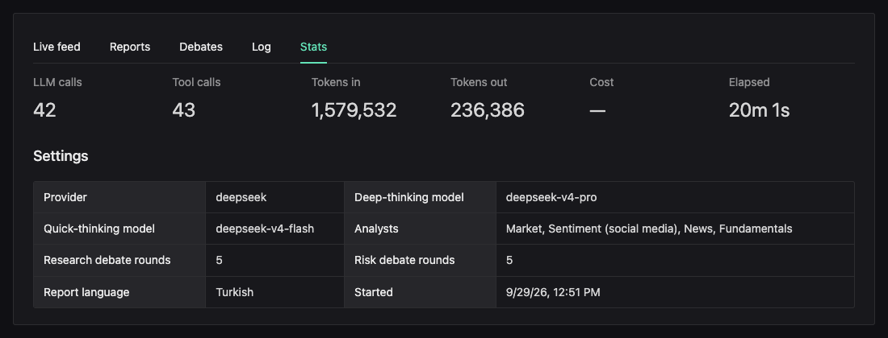
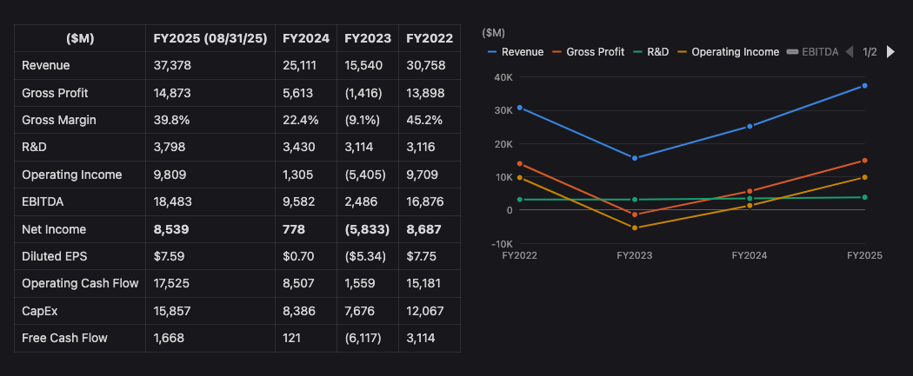
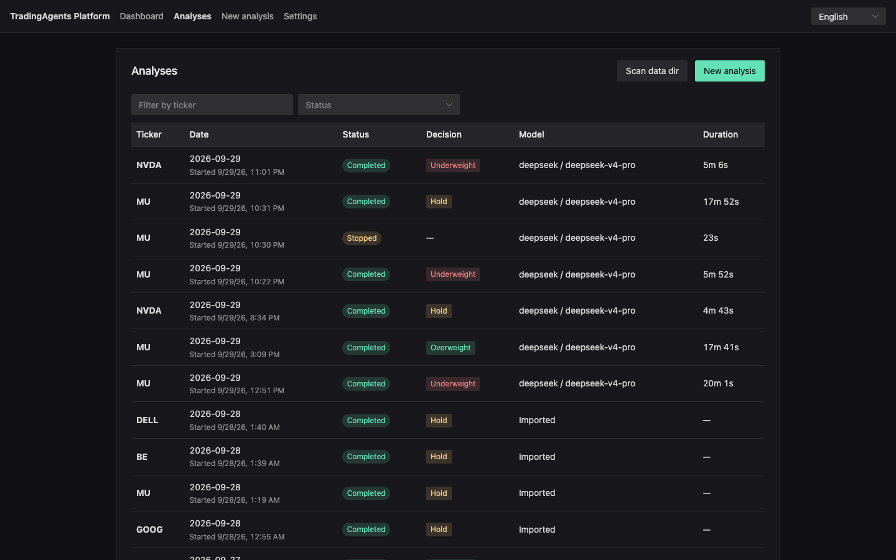
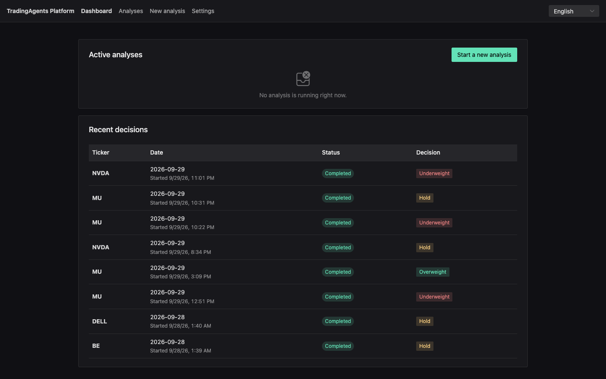

# TradingAgents Platform

A web platform for running and managing [TradingAgents](https://github.com/TauricResearch/TradingAgents)
analyses without modifying its code: start an analysis from the browser, watch the agents work live,
then read the decision, the reports and the debates. See [PLAN.md](PLAN.md) for the design and
roadmap and [docs/event-protocol.md](docs/event-protocol.md) for the runner contract.



| Artifact | Path | Stack |
|---|---|---|
| Platform (backend + UI, one jar) | `artifact/backend`, `artifact/frontend` | Java 25, Spring Boot 4.1 · Vue 3.5, Vite, Naive UI |
| Runner (installed into the TradingAgents runtime) | `artifact/ta-runner` | Python 3.12, uv, TradingAgents `v0.5.1` |

## Quick start

### 1. Prerequisites

- [mise](https://mise.jdx.dev/) — it installs the rest: Java 25 (Temurin) and
  [uv](https://docs.astral.sh/uv/), pinned in [`mise.toml`](mise.toml), into its own directory.
  Install it with `curl https://mise.run | sh` (or `brew install mise`).
- An API key for at least one LLM provider (OpenAI, Anthropic, Google, DeepSeek, xAI, Mistral,
  Groq, …), or a local [Ollama](https://ollama.com/), which needs no key.
- Nothing else: Node.js and pnpm are downloaded by the build, Python 3.12 by uv.

### 2. Start the platform

```sh
git clone https://github.com/ramazangirgin/trading-analysis-platform.git
cd trading-analysis-platform
mise trust && mise install   # once: Java 25 and uv for this repository
mise run setup               # once: ta-runner (downloads TradingAgents) and the UI packages
mise run run                 # builds the app if needed and serves it on :8080
```

Open **http://127.0.0.1:8080**. One process serves both the UI and the API; keep the terminal open
while you use it, and stop it with Ctrl+C. The first start takes a few minutes (Gradle's
dependencies, Node, building the UI and the backend); after that it starts in seconds, and after a
`git pull` it rebuilds only what changed. Analyses, presets and keys live on disk
([Where things live](#where-things-live)), so they survive restarts.

Changing the code instead? See [Development](#development) — it runs the UI with hot reload.

### 3. Add an API key

Open **Settings**, paste the key next to its provider and press **Save**. Keys are stored in
`~/.tradingagents-platform/secrets.env` (owner-only) and are never shown back. A key already in
`artifact/ta-runner/.env` is picked up too (read-only).



### 4. Start an analysis

Open **New analysis** and fill in:

| Field | What to enter |
|---|---|
| Ticker | Any Yahoo Finance symbol: `NVDA`, `THYAO.IS`, `BTC-USD` (crypto pairs switch the asset type automatically) |
| Analysis date | Defaults to the last weekday; future dates are rejected |
| Analysts | Market, Sentiment, News, Fundamentals — fewer analysts means a faster, cheaper run |
| Provider, models | A deep-thinking model (research/portfolio managers) and a quick-thinking one (everyone else); you can type a model id that is not listed |
| Debate rounds | 1 is enough to start; every extra round adds LLM calls |
| Report language | The language of the reports and the decision; follows the UI language by default |

Press **Start analysis**. **Save as preset** keeps the provider, model and analyst choices for next time.



### 5. Watch it and read the results

The analysis page updates live: the agent pipeline (analysts → research debate → trader → risk
debate → portfolio manager), a feed of agent messages and tool calls, the runner log, and token
counts. A full run with all four analysts can take 20 minutes or more, depending on the model and
the debate rounds (the example above: 41 LLM calls, ~1.1M input tokens, 18 minutes). **Stop** ends it; **Run again**
repeats it with the same settings.



When it finishes, the decision card shows the portfolio manager's rating (Buy / Overweight / Hold /
Underweight / Sell) with its reasoning, and the tabs hold everything behind it:

| Reports — one per analyst and manager | Debates — bull vs. bear, then the risk debate |
|---|---|
|  |  |



The market report opens with a price chart — close, 10 EMA, 50 SMA and 200 SMA with volume, over
3 months to a year up to the analysis date, from the price data TradingAgents itself downloaded —
and report tables that are series over periods (quarterly or yearly figures) get a chart beside them:



### 6. Past analyses

**Analyses** lists every run with its analysis date and start time, decision, model and duration,
filterable by ticker and status.
Runs made with the TradingAgents CLI are imported from `~/.tradingagents/logs` (read-only) —
**Scan data dir** picks up new ones.



The **Dashboard** shows the running analyses and the latest decisions at a glance.



### Language

The UI is in English. Reports are written in the language chosen in the New Analysis form's
"Report language" field; the analysis page shows it as a tag.

## Where things live


| Path | What |
|---|---|
| `~/.tradingagents-platform/platform.db` | Analyses and presets (SQLite) |
| `~/.tradingagents-platform/runs/<id>/` | `spec.json`, `events.jsonl` (replayed to the UI), `run.log` (runner stderr) |
| `~/.tradingagents/logs/` | TradingAgents' own reports, shared with its CLI; runs found here are imported (read-only) |

Override with `PLATFORM_HOME`, `TRADINGAGENTS_HOME` or `TRADINGAGENTS_RESULTS_DIR`.

## Development

### Dev servers

```sh
mise run dev
```

This starts two processes, and keeps them running until Ctrl+C:

| Process | Port | What it does |
|---|---|---|
| Spring Boot backend | 8080 | The API (`/api/...`), the database, starting and stopping analyses (it launches ta-runner) |
| Vite dev server | 5173 | Serves the Vue UI straight from `artifact/frontend/src`, reloads the browser on every change, and forwards `/api/...` to the backend |

Open **http://localhost:5173** (not :8080) while developing. UI changes show up immediately; backend
changes need a restart of `mise run dev`. Nothing listens on 5173 unless `mise run dev` is running —
to just use the app, `mise run run` is enough.

### Tasks

```sh
mise run setup         # uv sync for ta-runner (downloads TradingAgents), frontend packages
mise run dev           # backend on :8080 + Vite with hot reload on http://localhost:5173
mise run build         # all tests (ArchUnit included), lint, and the single jar
mise run run           # the single jar on http://127.0.0.1:8080, rebuilt when something changed
mise run test          # backend + frontend + ta-runner tests
mise run runner-test   # ta-runner tests and lint only
mise run api-types     # refresh the frontend's API types from the running backend
```

`mise tasks` lists them. Tasks run with the pinned Java on `PATH` and `JAVA_HOME` set, so nothing
needs overriding; with [mise activated](https://mise.jdx.dev/getting-started.html#activate-mise) in
your shell, plain `./gradlew` and `uv` in this directory use the same versions.

### Before pushing

- `mise run test` must pass.
- After changing the REST API: with `mise run dev` running (restarted after the change), run
  `mise run api-types`. It saves the backend's OpenAPI spec as `artifact/frontend/openapi.json` and
  regenerates `artifact/frontend/src/api/schema.d.ts`; commit both.

### ta-runner

```sh
cd artifact/ta-runner
uv sync
uv run pytest                       # unit, SIGTERM and upstream contract tests (no LLM calls)
uv run python -m ta_runner version

# Real analysis: needs the provider key in the environment (e.g. OPENAI_API_KEY).
# Edit example-spec.json (ticker, date, provider, models) first.
uv run python -m ta_runner run --spec example-spec.json --out /tmp/ta-run
```

Events stream to stdout as JSONL and are copied to `<out>/events.jsonl`; reports land under
`~/.tradingagents/logs/<TICKER>/<DATE>/reports/` (override with `TRADINGAGENTS_RESULTS_DIR`).

## License

Licensed under the [Apache License 2.0](LICENSE). Copyright 2026 Ramazan Girgin.

[TradingAgents](https://github.com/TauricResearch/TradingAgents), which `ta-runner` installs, is
also Apache-2.0-licensed and remains under its authors' copyright.
