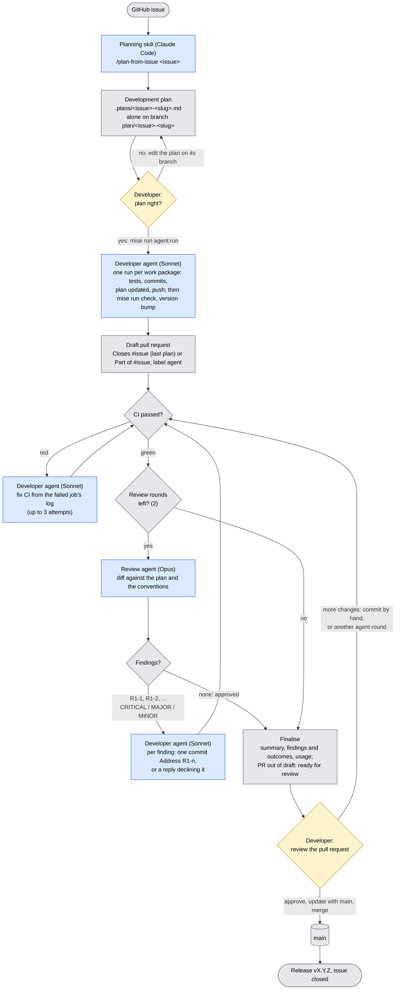

# Agentic development

Agents take a GitHub issue to a reviewed pull request with a green CI. A developer decides at two
points only: approving the plan and merging the pull request (#65). The agents follow the
documented architecture and conventions; the plan they work from is a file in the repository that
the developer reviewed, so their work can be checked against it.

## The flow



Yellow: the developer's two decisions. Blue: Claude Code (the planning skill in an interactive
session; the agents headless, with the developer's login). Grey: GitHub, CI and the scripts in
[`scripts/agent/`](../scripts/agent) that drive the loop and keep its state on the pull request.

| # | Step | Who | Output |
|---|---|---|---|
| 1 | Plan: read the issue and the documents of every part it touches; one plan per reviewable pull request | Claude Code skill `plan-from-issue` | `.plans/<issue>-<slug>.md` |
| 2 | One branch per plan, holding only that plan file | `scripts/agent/plan-branch.sh` (the skill runs it) | `plan/<issue>-<slug>` pushed, linked on the issue |
| 3 | Plan review: edit the plan on its branch, or approve it | Developer | — |
| 4 | Start the agents | Developer: `mise run agent:run plan/<issue>-<slug>` | — |
| 5 | Implement one work package per agent run, with tests, and push after each; `mise run check`, version bump; open a **draft** pull request; fix a red CI | Developer agent: `implement.sh`, `fix-ci.sh` | Draft PR labelled `agent`, **CI passed** green |
| 6 | Review against the plan and the conventions: one inline comment per finding, with priority and possible solutions | Review agent: `review.sh` | PR review + summary comment |
| 7 | One commit per finding (`Address R1-3: …`), or a reply declining it; reply on each thread; push | Developer agent: `fix.sh` | Commits, thread replies |
| 8 | Second review → fix round (6–7 again) | Agents | — |
| 9 | Finalise: what the plan asked for, what was done, findings fixed / declined / open, usage; the PR leaves draft (ready for review), `agent` label removed | `finalise.sh` | PR ready for review |
| 10 | Review, bring up to date with `main`, merge; the release follows | Developer | Change on `main`, released |

Agents never merge and never push to `main`: the scripts push only to the plan branch, the agents
cannot run `git push` or `gh`, and `main`'s ruleset requires a code owner's approval and
**CI passed** for every merge anyway.

## Decision

- **Everything runs on the developer's machine, with Claude Code.** Planning, implementation,
  review and fixes all run in Claude Code with the developer's own Claude Code login: the same
  skills, `CLAUDE.md`, subagents and hooks for every step, no API key or other model endpoint to
  manage, and no secrets in GitHub. The agents run headless (`claude -p`); the scripts remove any
  `ANTHROPIC_API_KEY`, `ANTHROPIC_AUTH_TOKEN` or `ANTHROPIC_BASE_URL` from their environment, so the
  login is always what they use. GitHub is reached through the developer's `gh` login and Git
  credentials, so the developer's pushes start CI as usual.
- **Scripts, one per step.** [`scripts/agent/`](../scripts/agent) holds one script per step and
  `run.sh`, which runs them all; mise tasks start them. Each step can also be run, and debugged, on
  its own.
- **The loop follows CI.** After every push the loop waits for **CI passed** on the new head, so a
  review always sees a green head, and a red CI goes to the developer agent first.
- **The pull request is the state.** Every step leaves one comment with a hidden marker
  (`<!-- agent-step step=review round=1 tokens=… -->`). `next.sh` reads the next step from these
  markers and CI's result; nothing else is stored, so an interrupted run continues where it was.
  Comments by other accounts are ignored. This covers the review → fix loop; before the pull request
  exists, the plan branch is the state (next bullets).
- **Progress is in the plan.** Every work package has a `- **Status**:` line in the plan: `open`,
  `done` (every step ticked, `- [x]`) or `not done: <reason>`. The developer agent sets it and ticks
  the steps in the plan file, in the same commit as the code, and the script reads it back
  (`scripts/agent/plan.py`) to know which package is next and whether one is finished. Every commit of a
  package ends with the trailer `Work-package: WP2`, so `git log --grep '^Work-package: WP2$'` lists
  its commits. The plan does not hold a commit SHA: a commit cannot name its own.
- **One agent run per work package.** `implement.sh` runs the developer agent once per package, in
  the order of the `Depends on` lines, each in a fresh session, and pushes the branch after each
  one. The context of a run stays small, the work survives the machine, and an interrupted
  implementation starts again at the package it was on: the packages the plan on the branch marks
  `done` or `not done` are skipped.
- **The state directory is inside `.git`.** Everything a run leaves behind goes to
  `.git/agent/<issue>-<slug>/` of the plan branch: `run.log` (the scripts' and agents' progress
  lines, with the milestone lines `agent: >> …` next to the tool lines), every prompt, agent result (`*.json`) and stream (`*.jsonl`), `current` (the package the
  implementation is on) and `run.pid` (the lock). Inside `.git` it is never committed, survives
  `git clean`, and is shared by the worktrees of the repository. A later run, even of another
  script, finds it. It is not deleted by the scripts; delete it after the merge.
- **The plan file is merged with the code.** It stays in `.plans/` as the record of why the change
  looks the way it does.
- **Sonnet develops, Opus reviews.** The developer agent does most of the work (implementing,
  running the checks, fixing), where Sonnet is fast and good enough; the review is a single,
  judgement-heavy pass per round, where the stronger model finds more. Both are settings.
- **A fixed number of rounds**: two review → fix rounds, then the pull request goes to the
  developer, even when `MINOR` findings remain.

## Review findings

Each finding is one inline comment on the line concerned, or on the file when the line is not part
of the diff (a finding outside the diff goes into the review's body):

- an ID, `R<round>-<n>`, that the fix commit (`Address R1-3: <summary>`) and its reply refer to;
- a priority: `CRITICAL` (a bug, data loss, a security problem, a missing plan item: must be fixed),
  `MAJOR` (an edge case, a broken convention, a missing test: should be fixed), `MINOR` (optional);
- the problem, and one or more possible solutions;
- the other places with the same problem ("Same finding also at"), instead of a comment each.

The review checks the diff against the plan (missing items, out-of-plan changes), correctness,
the conventions of the parts it touches, tests and docs. The summary comment counts the findings
per priority and says whether another round is needed.

**A round with no findings approves the reviewed commit**: the review says "✅ Approved by the review
agent" with the commit, and the loop goes straight to finalising: no empty fix round, and no second
review of the same commit. The approval is a review comment, not a GitHub approval: the agents work
as the pull request's author, and GitHub does not let an author approve their own pull request. The
code owner's approval is still what the merge needs. The final comment says whether the review agent
approved the latest commit.

The developer agent handles one finding per run, most severe first. A fix becomes one commit
through the pre-commit hook; a finding it disagrees with gets a reply with the reason instead of a
change. A thread a developer resolves before the fix round is skipped.

## From issue to `main`: a walkthrough

What a developer does, from an issue to its change released on `main`. The agents do everything
between "start the agents" and "review the pull request".

### 0. Once per machine

```sh
mise run setup      # ta-runner, the frontend's packages and the Git hooks the agents commit through
claude              # then /login: the agents use this Claude Code login
gh auth login       # the scripts push, comment and open pull requests as you
```

### 1. The issue

The agents work from the plan, and the plan from the issue, so the issue needs a clear goal, steps
and "done when" (the shape of the existing issues). A vague issue gives a vague plan: sharpen the
issue first, it is cheaper than reviewing a wrong plan.

### 2. Plan it

In Claude Code, in this repository:

```text
/plan-from-issue 32
```

The skill ([`.claude/skills/plan-from-issue/SKILL.md`](../.claude/skills/plan-from-issue/SKILL.md))
reads the issue, the issues it links to and the documents of every part it touches, and writes
`.plans/<issue>-<slug>.md` from [`plan-template.md`](../.claude/skills/plan-from-issue/plan-template.md),
or several plans when the issue does not fit one pull request. Discuss it with Claude in the same
session until it is right; then the skill pushes one branch per plan
(`mise run agent:plan-branch .plans/<issue>-<slug>.md`) and links it on the issue. The local plan
file is removed once its branch is pushed, so the working tree is clean for step 5.

The scripts read the plan's work packages, so their format is fixed: a `### WP<id>: <name>` heading,
a `- **Status**: open` line (the agent sets `done` or `not done: <reason>` and ticks the steps), a
`- **Depends on**:` line with package IDs (`none`, `WP1, WP2`, a range `WP2–WP4`), optionally followed by a
reason in parentheses, and `- [ ]` steps. A plan without `Status` lines counts every package as
`open`; a plan without work packages is one package.

### 3. Review the plan

This is the first of the two decisions that are yours. Read the plan on its branch and check:

- the goal matches the issue, and "Out of scope" leaves out what it should;
- each part names the right conventions, and the design puts the code where they say;
- every work package has its tests, and the tests prove the issue's "done when"; every `Status` is
  `open` and the `Depends on` lines are right (they decide the order the agent works in, and each
  package is pushed on its own, so it should leave the repository green);
- the version bump (`minor`, `major` for a breaking change);
- "Docs to update" covers the README text for the feature and every screenshot: a new page gets
  one, a page whose look changes gets it retaken. "Later" is not an option: the review agent checks
  the docs and screenshots, and a missing one is a `MAJOR` finding;
- the open questions: answer them in the plan.

Change the plan on its branch (edit, commit, push) until you would accept a pull request that does
exactly that. The agents follow it literally, and the review agent checks the code against it.

### 4. Start the agents

```sh
mise run agent:run plan/32-compare-runs
```

From a clean working tree (the scripts switch to the plan branch). It runs steps 5–9 of the flow:
the developer agent (Sonnet) implements the plan one work package at a time, each with its tests,
commits and update of the plan, and the script pushes the branch after every package (that starts
CI, which cancels the run of the previous push). Then the script checks the whole, the last package
bumps the version, and it opens a **draft** pull request labelled `agent` (`Closes #<issue>`, or
`Part of #<issue>` while other plans of the issue are not merged yet); after **CI passed**, the
review agent (Opus) reviews it, the developer agent fixes the findings, CI runs again, and once
more; then the pull request gets a final comment and is marked ready for review. It waits for CI
after every push, so it takes a while: leave the terminal open. Follow it on the pull request,
where every step leaves a comment, or in the terminal: while an agent runs, each of its steps (tool
call, message, to-do) is printed as one line with the time since it started, and after two quiet
minutes (a long build) a "still working" line. The same lines go to
`.git/agent/<issue>-<slug>/run.log` (appended, one header line per start), next to every agent's
result and full stream (`wp-WP2.json`, `wp-WP2.jsonl`, `review-1.json`, …); the paths are printed
as the first lines of every step.

Between the tool lines, one **milestone line** per event starts with `agent: >> `: a work package
started or done, tests, `mise run check` and its result, a commit, a push, the draft pull request,
CI waiting, passed or failed (with the failed jobs), a review round and its findings, a fix round and
each finding's outcome, finalise, and a stop with its reason. `grep '^agent: >> ' run.log` lists
them. `mise run agent:status plan/32-compare-runs` (or a pull request number) shows where a run is:
the active process, the work package, the latest milestones and the end of `run.log`.
`scripts/agent/status.sh --follow <branch | pr>` prints only the milestones written from now on.
A second run on the same branch is refused while one is active (the lock,
`run.pid` in the same directory).

The scripts run from a copy of `scripts/agent/` taken at start, so switching branches does not
change the running scripts or prompts. Each step can also be run on its own:

```sh
mise run agent:implement plan/32-compare-runs        # implement, push, draft pull request
scripts/agent/implement.sh --dry-run plan/32-compare-runs # work packages and their status, what a run would do
scripts/agent/next.sh --dry-run plan/32-compare-runs # which step is next
mise run agent:next plan/32-compare-runs             # continue the loop to its end
scripts/agent/review.sh <pr>                         # one step: review, fix, fix-ci, finalise
```

`AGENT_BASE_BRANCH=<branch>` starts the plan branch from, and opens the pull request into, another
branch than `main` (a stacked change, or trying out a change to the agents themselves); later steps
use the pull request's base.

To keep a run going when the terminal (or the Claude Code session) closes, start it detached:

```sh
mise run agent:detach run.sh plan/32-compare-runs    # or implement.sh, next.sh <pr>, …
tail -f .git/agent/32-compare-runs/run.log           # follow it
kill -- -<pid>                                       # stop it (the pid printed at the start)
```

`detach.sh` starts the script in a new session with its output in `run.log`, and prints the process
ID and the log. Stopping it releases the lock; started again, the run resumes (see below).

#### From Claude Code, with one approval: the plan

The `develop-issue` skill
([`.claude/skills/develop-issue/SKILL.md`](../.claude/skills/develop-issue/SKILL.md)) goes through
steps 2 to 8 of this walkthrough in one Claude Code session. It works in a folder of its own: a
Git worktree `../<checkout>-<issue>` checked out from `origin/main` (reused when it exists), so it
never switches branches or writes in the checkout the session started in, and several issues can
run side by side. It asks the developer only to approve the plan. Every later step runs without asking: pushing the plan branch, the implementation, each CI
fix, review, fix round and the finalising, and the update with `main`. When the pull request is
ready for review (up to date with `main`, **CI passed** green), or when the run stops early, it
sends a notification. It never merges: merging stays the developer's decision, and the skill merges
only when asked to in the session.

```text
/develop-issue 32
/develop-issue https://github.com/<owner>/<repo>/issues/32
```

It plans with the `plan-from-issue` skill, invoked from it, and runs the same scripts one step at a time
(`implement.sh`, then `next.sh --dry-run` for the next step and that step's script), so the pull
request and its state comments are the same as with `mise run agent:run`, and `mise run agent:next`
can take over the loop at any point. While a step runs, the session reports one line per milestone
as it happens (from `run.log`, through `status.sh --follow`) and nothing for the agents' tool calls;
ask it for the status at any time (`status.sh`). It prints the command to follow a step in a
terminal first: `tail -f .git/agent/<issue>-<slug>/run.log`. The agents may not edit the skills
under `.claude/`, so a plan item there comes back "not done" and is done by hand. Started again, it
reads where the issue stands from its plan branches and pull requests and continues there.

### 5. When a run stops early

- **Ctrl+C**, a closed laptop, a crash, a usage limit: start `mise run agent:run` again; it
  continues where it was. During the implementation the state is the plan on the branch: the
  packages it marks `done` or `not done` are skipped, and the uncommitted work of the package that
  was interrupted stays in the working tree, where the agent is told to read it, keep what is right
  and finish it. Nothing is discarded. (`implement.sh --dry-run <branch>` shows which package that
  is.) The pull request is opened as in an uninterrupted run. Later, the state is the pull request.
  The tokens of the interrupted run are counted from its stream in the step's usage, marked
  partial: the cost shows as "at least", because an interrupted run's cost is unknown.
- **A run is already active** (`a run is already active: pid …`): the lock of the branch is held by a
  live process. Follow it in its `run.log`, or stop it (`kill -- -<pid>` for a detached one). A lock
  of a process that is gone is replaced.
- **The loop gave up** (a comment "Agent loop stopped", the `agent` label removed, the pull request
  still a draft): CI stayed red after `AGENT_MAX_CI_FIXES` attempts, the developer agent found no
  fix, CI took longer than `AGENT_CI_TIMEOUT`, or the run went over `AGENT_MAX_TOKENS`. Fix the
  cause by hand on the plan branch (or not at all), then either continue by hand, or add the
  `agent` label again and run `mise run agent:next plan/<issue>-<slug>`.
- **To stop it yourself**: Ctrl+C, or remove the `agent` label (the loop does nothing on the pull
  request any more).

### 6. Review the pull request

The second decision that is yours. Start with the final comment ("Done: ready for review"): whether
the review agent approved the latest commit, the plan's work packages, the commits, every review
finding with its outcome, and the usage. Then:

- **Open and declined findings** first: an open one was not addressed (a fix that failed the
  pre-commit hook, or a round that did not run); a declined one has the developer agent's reason in
  its thread. Decide each.
- Read the diff as you would any pull request: against the plan, with the conventions in mind. The
  agents' review covered it twice, but it is not a substitute for yours.
- The docs: the README describes the feature, and the screenshots in `docs/screenshots/` show it
  (the pull request's *Files changed* shows the PNGs side by side with the old ones).
- Try it: `git switch plan/<issue>-<slug>` and `mise run dev` (or `mise run run`).

### 7. More changes

- **Small ones**: commit them yourself on the plan branch and push. CI runs as for any pull request.
- **Another agent round**: turn the pull request back into a draft, add the `agent` label and raise
  the round limit:

  ```sh
  gh pr ready <pr> --undo && gh pr edit <pr> --add-label agent
  AGENT_MAX_ROUNDS=3 mise run agent:next plan/<issue>-<slug>
  ```

  The review agent runs a third round and the developer agent fixes its findings. The agents do not
  read your own review comments; to steer them, change the plan on the branch first (the review
  agent reads it every round).
- **Wrong direction**: close the pull request, fix the plan (or the issue), and start again from
  step 2 with a new plan branch.

### 8. Bring it up to date with `main`

The `main` ruleset merges only a pull request whose branch is up to date with `main`, whose
**CI passed** is green, and that a code owner approved (see the root README). If `main` moved while
the agents worked:

```sh
git fetch origin && git switch plan/<issue>-<slug> && git pull
git rebase origin/main            # resolve conflicts, if any; mise run check
mise run version:bump minor       # only if main's version caught up with this branch's
git push --force-with-lease
```

The **Version** job fails when another pull request merged the same version first
([versioning and releases](coding-convention/repository-versioning-and-releases.md)): bump again. Wait for
**CI passed** on the new head.

### 9. Merge

Approve and merge it yourself; nothing merges on its own (auto-merge is off) and the agents never
merge:

```sh
gh pr merge <pr> --rebase --delete-branch
```

A pull request into another branch than `main` (`AGENT_BASE_BRANCH`) is retargeted to `main` once
the branch it stacks on has merged: `gh pr edit <pr> --base main`, then step 8.

### 10. After the merge

- CI runs on `main`; after **CI passed**, [`release.yml`](../.github/workflows/release.yml) tags
  the commit `vX.Y.Z` and publishes the GitHub Release with the jar.
- `Closes #<issue>` in the pull request closes the issue. A split issue stays open until the
  pull request of its last plan has merged: the scripts write `Closes #<issue>` only when every
  other `plan/<issue>-*` branch has a merged pull request, and `Part of #<issue>` otherwise. They
  decide when the pull request is opened and again when it is marked ready for review. When two
  plans of an issue are ready at the same time, neither closes it: close the issue by hand after
  the second one merges, or change its `Part of` to `Closes` before merging it.
- The plan stays in `.plans/` on `main`, next to the code it explains.
- Locally: `git switch main && git pull`, and delete the local plan branch
  (`git branch -D plan/<issue>-<slug>`) and its state directory
  (`rm -rf .git/agent/<issue>-<slug>`).

## Documentation and screenshots

A change is documented in its own pull request: the plan lists the documents and screenshots it
affects ("Docs to update"), the developer agent updates them, and the review agent checks them
against the plan and on its own (a user-visible change without its description or screenshot is a
`MAJOR` finding).

The README's screenshots (`docs/screenshots/*.png`) are taken by Playwright, the way the end-to-end
tests run: the built jar with a throwaway home and ta-runner replaying a recording, in Google
Chrome, at 1440×900 in the dark theme. One `e2e/screenshots/<name>.shot.ts` per screenshot sets up
the data it needs over the API, opens the page and saves it with `shot(page, '<name>')`:

```sh
mise run screenshots             # every screenshot
mise run screenshots compare     # those whose file or title matches "compare"
```

`SCREENSHOT_DIR=<dir>` writes them elsewhere, to try one out. The agents look at the saved PNGs
with Claude Code's Read tool. Screenshots taken by hand from real runs stay until a change retakes
them.

## Settings

Environment variables of the scripts ([`lib.sh`](../scripts/agent/lib.sh)):

| Variable | Default | What |
|---|---|---|
| `AGENT_MODEL` | `claude-sonnet-5-5` | The developer agent's model (implement, fix-ci, fix) |
| `AGENT_REVIEW_MODEL` | `claude-opus-5-5` | The review agent's model |
| `AGENT_MAX_ROUNDS` | 2 | Review → fix rounds |
| `AGENT_MAX_CI_FIXES` | 3 | Attempts at a red CI, per pull request |
| `AGENT_MAX_TOKENS` | 50 000 000 | Tokens per pull request, cached input included |
| `AGENT_MAX_BUDGET_USD` | none | Per agent call (`claude --max-budget-usd`) |
| `AGENT_CI_TIMEOUT` | 60 | Minutes to wait for CI after a push |
| `AGENT_BASE_BRANCH` | `main` | Where plan branches start and pull requests go |

Costs in the final comment are Claude Code's own figures at API prices; with a subscription login
they show the usage, not a bill. The usage of runs from before the state directory existed, or of
a state directory that is gone (another machine), is not available; the implement comment says so.

## Safety

- The agents run with an allow-list of tools (`--permission-mode dontAsk`): no `git push`, no
  `gh`, no skipping the Git hooks, no web search; the review agent only reads. The scripts do every
  push and every GitHub call.
- What the agents read is the reviewed plan, the code, CI's logs and their own review comments,
  not comments by other accounts.
- The agents run real commands (Gradle, pnpm, uv) on the developer's machine, like a developer
  would; run them only on plans you reviewed.

## Not done yet

- **Parallel work packages** each in their own `git worktree` (#70): for now the packages run one
  after the other, one agent run each; the per-package loop (`plan.py next`) is what parallel runs
  will build on.
- **Sub-issues** for the plans of a split issue.
